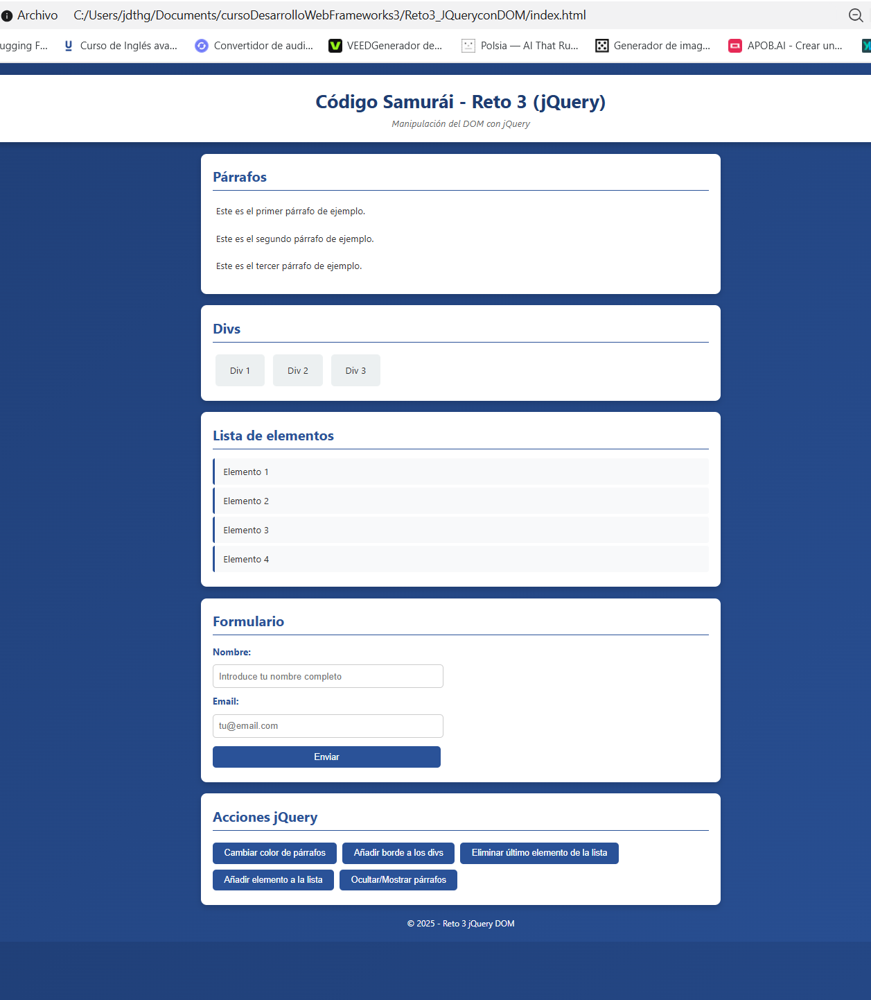
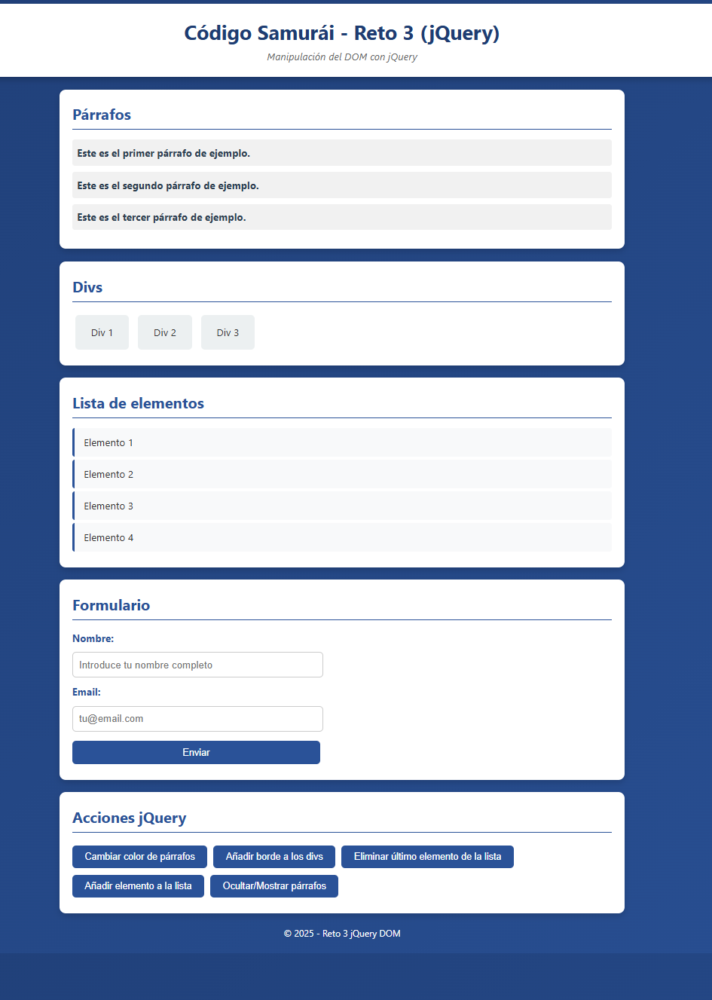
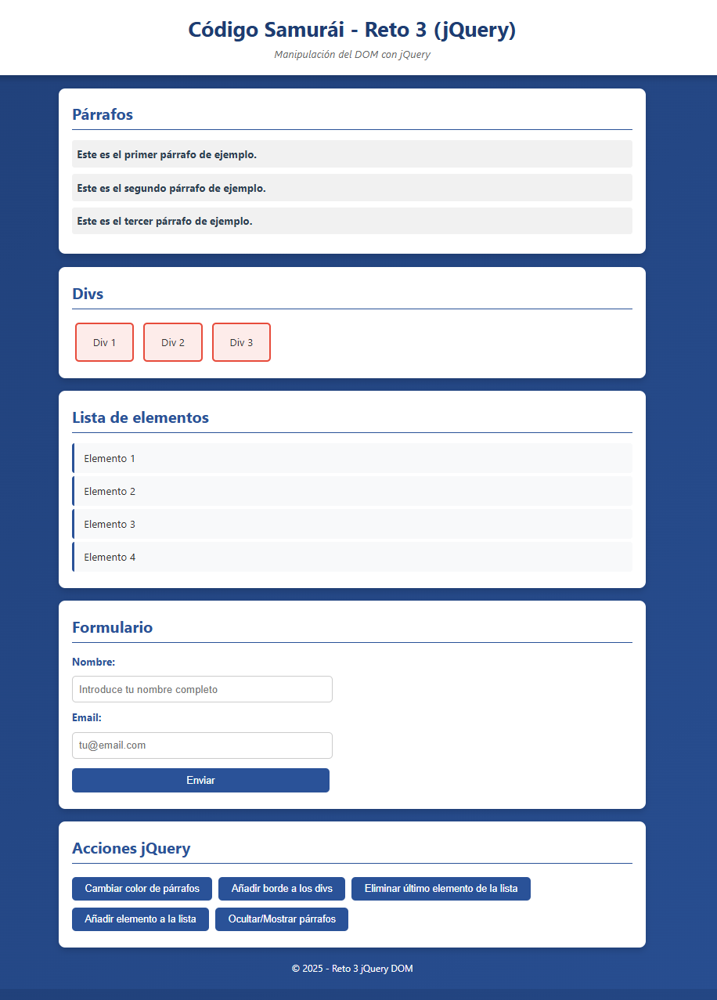
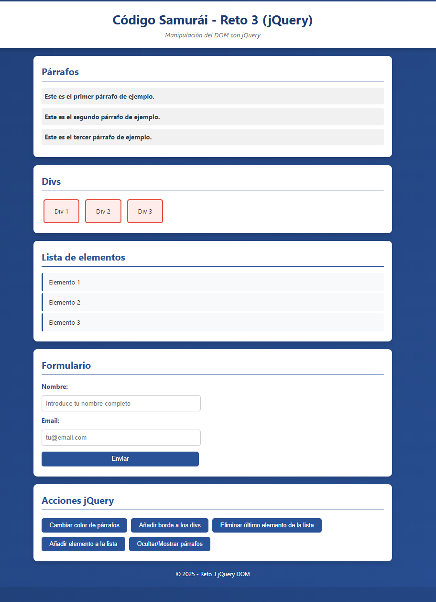
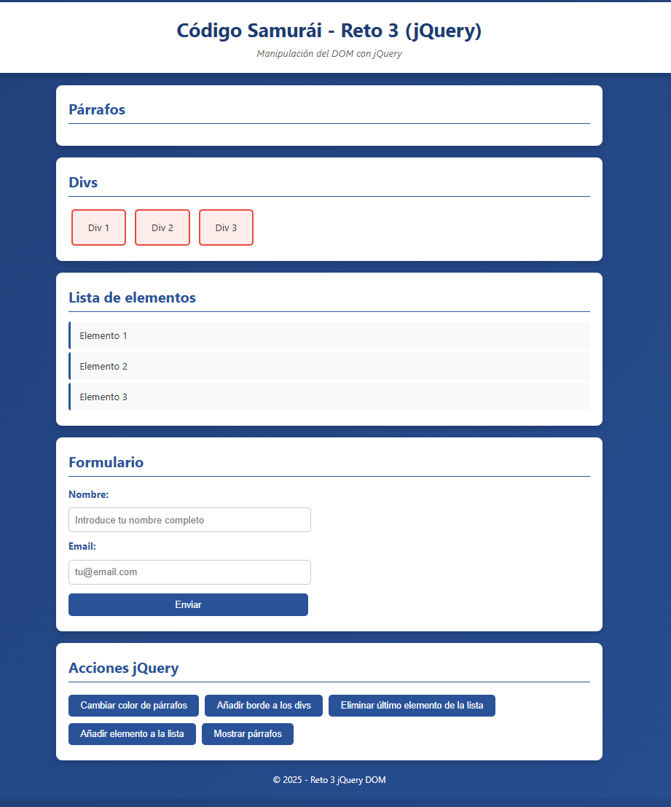
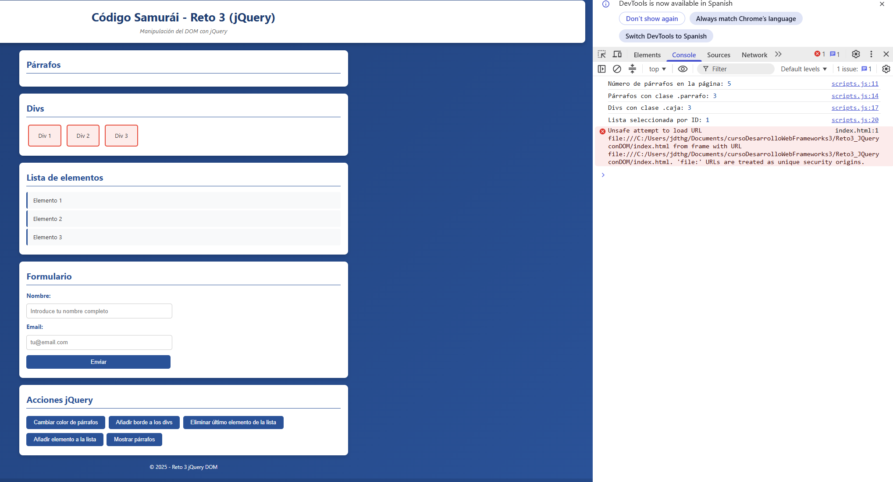

Set-Location "C:\Users\jdthg\Documents\cursoDesarrolloWebFrameworks3\Reto3_JQueryconDOM"

@'
# Reto 3 - Manipulación del DOM con jQuery

## 📋 Descripción
Proyecto del curso **Código Samurái** (Desarrollo Web Frameworks 3) que demuestra la manipulación del DOM mediante **jQuery 3.6.0**: selección, modificación y eliminación de elementos.

## 🛠️ Tecnologías utilizadas
- HTML5
- CSS3
- jQuery 3.6.0 (vía CDN)

## 🚀 Cómo ejecutar
1. Clona este repositorio o descarga los archivos.
2. Abre el archivo `index.html` en tu navegador (Chrome, Firefox o Edge).
3. Abre las DevTools con **F12** y ve a la pestaña **Console** para ver los `console.log` de las selecciones jQuery.
4. Prueba cada botón de la sección **"Acciones jQuery"**.

## ✨ Funcionalidades implementadas

| Botón / Acción | Método jQuery usado |
|---|---|
| Cambiar color de párrafos | `.css()` |
| Añadir borde a los divs | `.css()` |
| Eliminar último elemento de la lista | `.last()`, `.fadeOut()`, `.remove()` |
| Añadir elemento a la lista | `$()`, `.appendTo()`, `.fadeIn()` |
| Ocultar / Mostrar párrafos | `.slideUp()`, `.slideDown()` |
| Envío del formulario | `.on('submit')`, `.val()`, `.reset()` |

## 🎯 Tipos de selecciones demostradas
- **Por etiqueta:** `$("p")`
- **Por clase:** `$(".parrafo")`, `$(".caja")`
- **Por ID:** `$("#lista-elementos")`

## 📸 Capturas de pantalla

### 1. Estado inicial

### 2. Cambio de color en los párrafos

### 3. Borde añadido a los divs

### 4. Elemento eliminado de la lista

### 5. Párrafos ocultos con animación

### 6. Consola mostrando las selecciones jQuery

## 📂 Estructura del proyecto

Reto3_JQueryconDOM/
├── capturas/
│ ├── 01-estado-inicial.png
│ ├── 02-color-parrafos.png
│ ├── 03-borde-divs.png
│ ├── 04-elemento-eliminado.png
│ ├── 05-parrafos-ocultos.png
│ └── 06-consola-jquery.png
├── index.html
├── scripts.js
├── styles.css
├── README.md
└── .gitignore

## 👤 Autor
- **Nombre:** Judit Giravent
- **Curso:** Desarrollo Web Frameworks 3 - Código Samurái
- **Año:** 2026
'@ | Out-File -FilePath "README.md" -Encoding UTF8

Write-Host "✅ README.md con capturas creado" -ForegroundColor Green